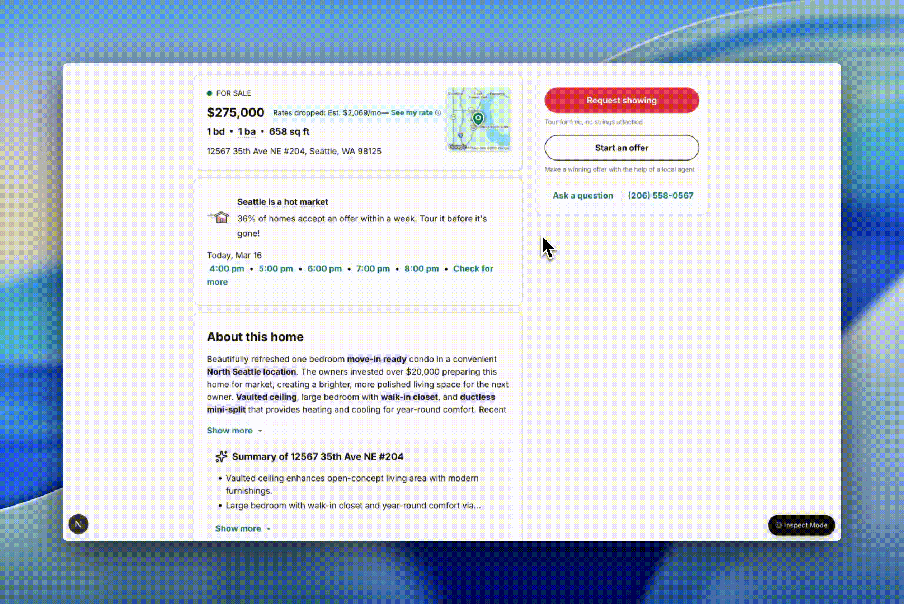

Creator: Xinran Ma

More resources like this on: designwithai.co

_Disclaimer: Work-in-progress personal tool_

# design-inspect



## What it is

Click any element in your running app, type what you want changed, and Claude Code finds the exact line and edits it — no describing elements in words, no hunting for the right file.

## When to use it

- You see something in your running app you want to change and don't want to describe it in words
- You want to point at a button, a label, a card — and just say "make this rounder" or "more breathing room"
- You're iterating on visual details quickly and context-switching to the code editor breaks your flow
- You want to select multiple elements at once and change them all in one prompt
- You're making UI tweaks and know what you want but not exactly where it lives in the codebase

## How to use it

### Install (one time)

```bash
git clone https://github.com/xinran-dwi/skills.git /tmp/xinran-skills
mkdir -p ~/.claude/skills
mv /tmp/xinran-skills/design-inspect ~/.claude/skills/
```

Restart Claude Code.

### Step by step

1. **Start your app** — make sure it's running in the browser (e.g. `http://localhost:3000`)

2. **Trigger the skill** — type `/design-inspect` in Claude Code, or say "inspect mode" / "design mode" / "I want to click the thing I want to change"

3. **Get the overlay** — Claude opens your app in the browser and copies the inspect overlay script to your clipboard

4. **Paste the script** — in the browser, open DevTools Console (`⌥⌘J` on Mac / `Ctrl+Shift+J` on Windows), paste, and hit Enter

5. **Turn on Inspect Mode** — click the **◎ Inspect Mode** button in the bottom-right corner of the page

6. **Click elements** — hover to see a blue outline, click to select. You can select multiple elements — each click adds to your selection

7. **Type your change** — describe what you want in plain words: "make the button rounder", "reduce the padding here", "make this label bolder"

8. **Copy and paste** — hit **Copy to clipboard** (or Enter), switch to Claude Code, and paste. Claude locates the exact JSX, opens the file, and makes the edit

### Optional: skip the paste step

Install `userscript.user.js` in [Tampermonkey](https://www.tampermonkey.net/). The overlay auto-loads on every `localhost` page — skip steps 3–4 above entirely.

## Requirements

- [Claude Code](https://claude.ai/code)
- A Next.js project running locally (`npm run dev` or similar)
