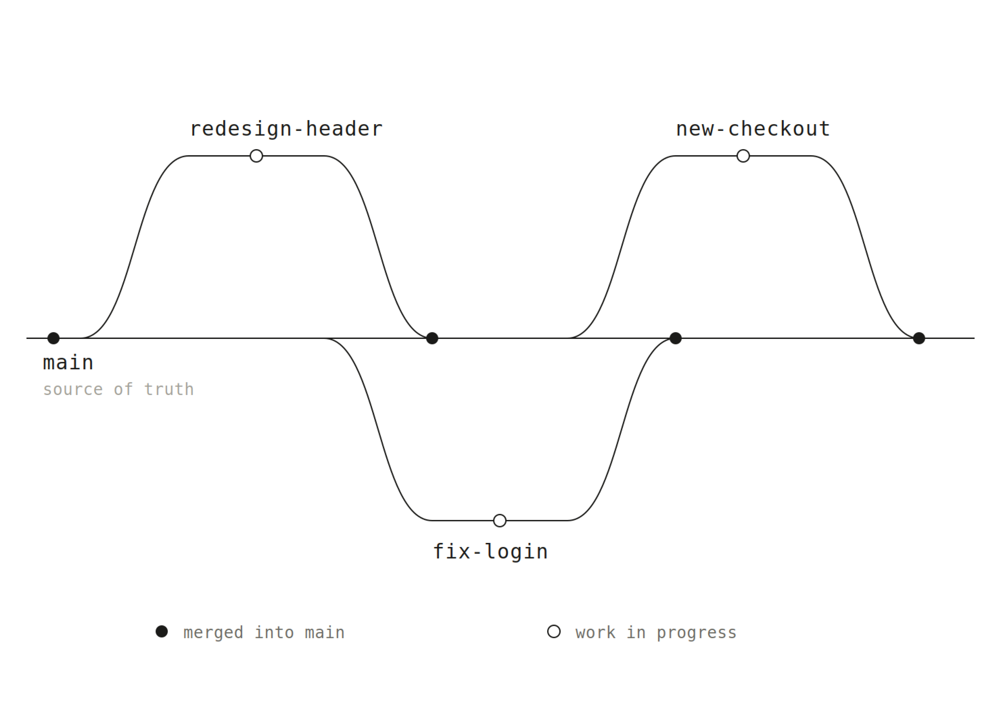

Creator: Xinran Ma

More resources like this on: designwithai.co

# newsletter-diagram

## What it is

Turns any diagram request into a clean, intentional-looking PNG — monochrome hairline strokes, monospace lowercase labels, near-square corners, and generous whitespace. The opposite of the colorful pastel-pill "generated" look. Great for newsletters, slides, docs, READMEs, and Figma.



## When to use it

- You want a diagram that looks designed, not auto-generated
- You're dropping a visual into a newsletter, slide deck, or doc and need a real image file (not an inline widget)
- You ask for a git/branch diagram, timeline, flow, architecture sketch, or UI mockup and want it as a downloadable PNG
- You say things like "minimalist diagram", "monochrome diagram", "make it a PNG", "for my newsletter", or "same diagram style as before"

## How to use it

### Install (one time)

**macOS / Linux**
```bash
mkdir -p ~/.claude/skills/newsletter-diagram/references
mkdir -p ~/.claude/skills/newsletter-diagram/scripts
curl -fsSL https://raw.githubusercontent.com/xinran-dwi/skills/main/newsletter-diagram/SKILL.md -o ~/.claude/skills/newsletter-diagram/SKILL.md
curl -fsSL https://raw.githubusercontent.com/xinran-dwi/skills/main/newsletter-diagram/references/style.md -o ~/.claude/skills/newsletter-diagram/references/style.md
curl -fsSL https://raw.githubusercontent.com/xinran-dwi/skills/main/newsletter-diagram/scripts/render_png.py -o ~/.claude/skills/newsletter-diagram/scripts/render_png.py
```

**macOS only** — install the Cairo rendering library if you don't have it:
```bash
brew install cairo
```

**Windows (PowerShell)**
```powershell
New-Item -ItemType Directory -Force "$env:USERPROFILE\.claude\skills\newsletter-diagram\references"
New-Item -ItemType Directory -Force "$env:USERPROFILE\.claude\skills\newsletter-diagram\scripts"
Invoke-WebRequest "https://raw.githubusercontent.com/xinran-dwi/skills/main/newsletter-diagram/SKILL.md" -OutFile "$env:USERPROFILE\.claude\skills\newsletter-diagram\SKILL.md"
Invoke-WebRequest "https://raw.githubusercontent.com/xinran-dwi/skills/main/newsletter-diagram/references/style.md" -OutFile "$env:USERPROFILE\.claude\skills\newsletter-diagram\references\style.md"
Invoke-WebRequest "https://raw.githubusercontent.com/xinran-dwi/skills/main/newsletter-diagram/scripts/render_png.py" -OutFile "$env:USERPROFILE\.claude\skills\newsletter-diagram\scripts\render_png.py"
```

Restart Claude Code.

### Step by step

1. **Trigger the skill** — just ask naturally (no slash command required):
   - "Make a git branch diagram for my newsletter"
   - "Draw a minimalist timeline of this project"
   - "Turn this flow into a downloadable PNG"
   - "Same diagram style as before"

2. **Claude plans the layout** — it sketches the diagram mentally on a 900px canvas, choosing from the fixed vocabulary: solid dots for landed states, hollow dots for in-progress, solid lines for established paths, dashed lines for attempts or blocked states

3. **SVG is built by hand** — coordinates are placed precisely using the monospace grid (each glyph ≈ 0.6× font-size wide), with a fixed monochrome palette: one ink color on white, no theme variables

4. **Rendered to PNG at 2× resolution** — the bundled `render_png.py` script rasterizes the SVG via `cairosvg` and writes a high-res PNG file you can download immediately

5. **Delivered as a file** — Claude presents the PNG and gives a one-sentence summary. If any label is misaligned, describe the fix and it re-renders

## Requirements

- [Claude Code](https://claude.ai/code)
- Python 3 (pre-installed on macOS and most Linux distros)
- Cairo graphics library (`brew install cairo` on macOS; `apt install libcairo2` on Linux)
- `cairosvg` Python package (installed automatically on first use)
